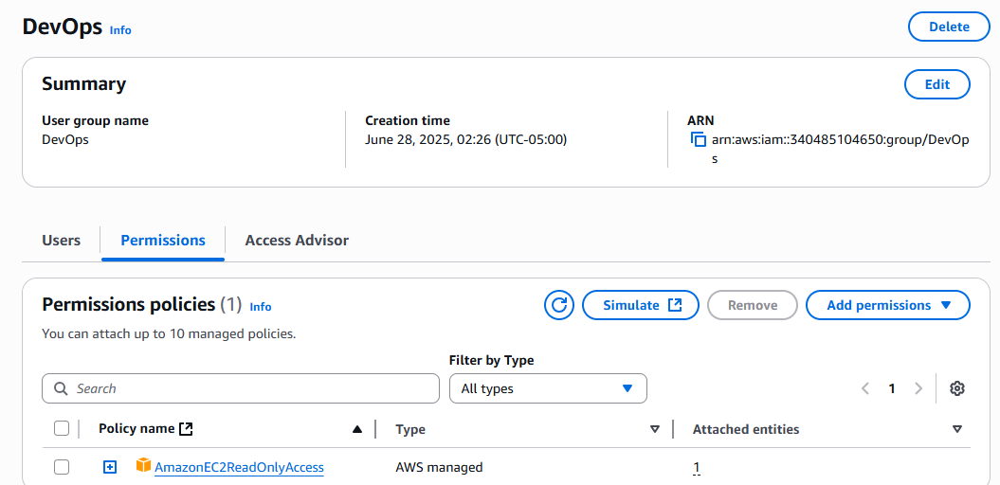

# AWS Cloud Security Homelab Project: IAM Least Privilege

## Objective

Simulated a real-world security scenario by implementing IAM roles and policies within AWS, applying the principle of "least privilege". This project focuses on providing just enough access for a user to perform specific tasks — and nothing more.

---

## Environment Setup

### IAM Group: `DevOps`
- **Policy Attached:** `AmazonEC2ReadOnlyAccess`  
  (AWS Managed Policy – Grants view-only access to EC2 resources)

### IAM User: `dev-user`
- **Group Membership:** `DevOps`
- **Console Access:** Enabled (with a custom password)
- **MFA:** Activated

---

## Access Verification

| Test Action              | Expected Outcome | Actual Outcome |
|--------------------------|------------------|----------------|
| View EC2 Instances       | ✅ Allowed        | ✅ Allowed      |
| Launch or Stop EC2       | ❌ Denied         | ✅ Denied       |

> ✅ *Test confirmed that permissions are restricted to read-only access as intended.*

>
> ### IAM User Sign-In Page 

---

## Key Learnings

- Gained hands-on experience creating IAM users and groups
- Understood how AWS managed policies work and how to assign them effectively
- Successfully implemented the **principle of least privilege**
- Practiced validating permissions via the AWS Management Console

---

## Tools & Services Used

- **AWS IAM Console** – For managing users, groups, and policies
- **AWS EC2 Console** – For testing permission scopes
- **GitHub** – For documentation and version control

---

## Next Steps

▶️ **Project 2:** Enable **AWS CloudTrail** to log user activity and create a centralized audit trail. This will help monitor and audit all IAM actions and detect any anomalies.

---

